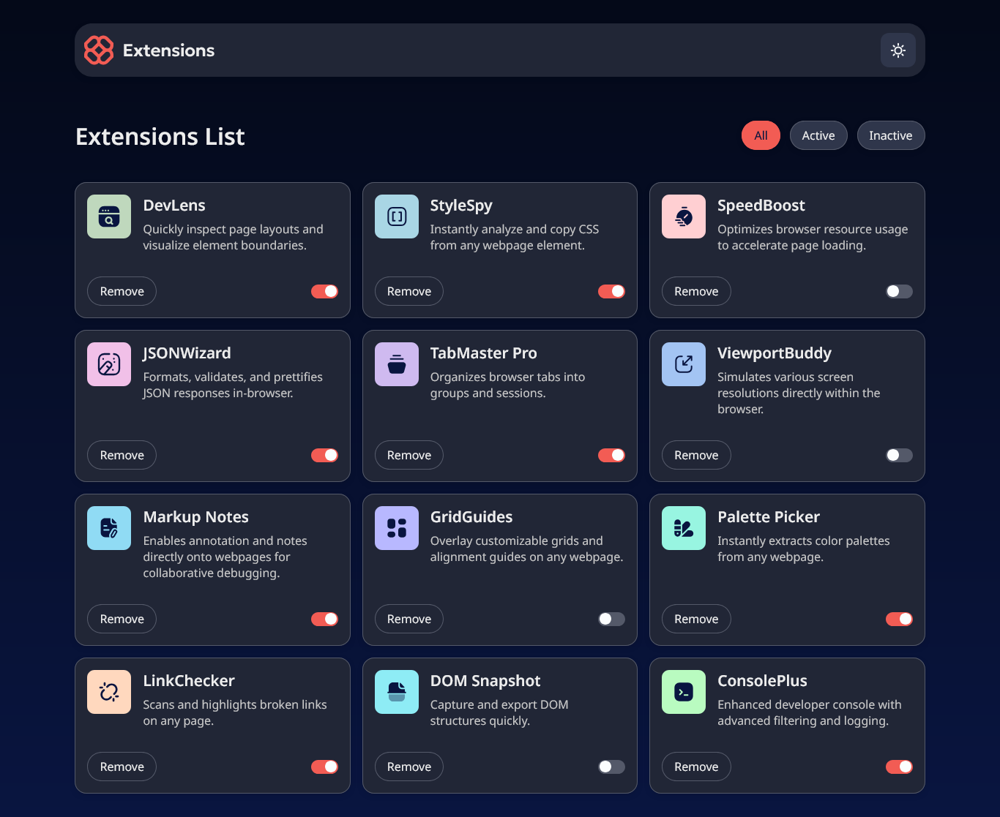
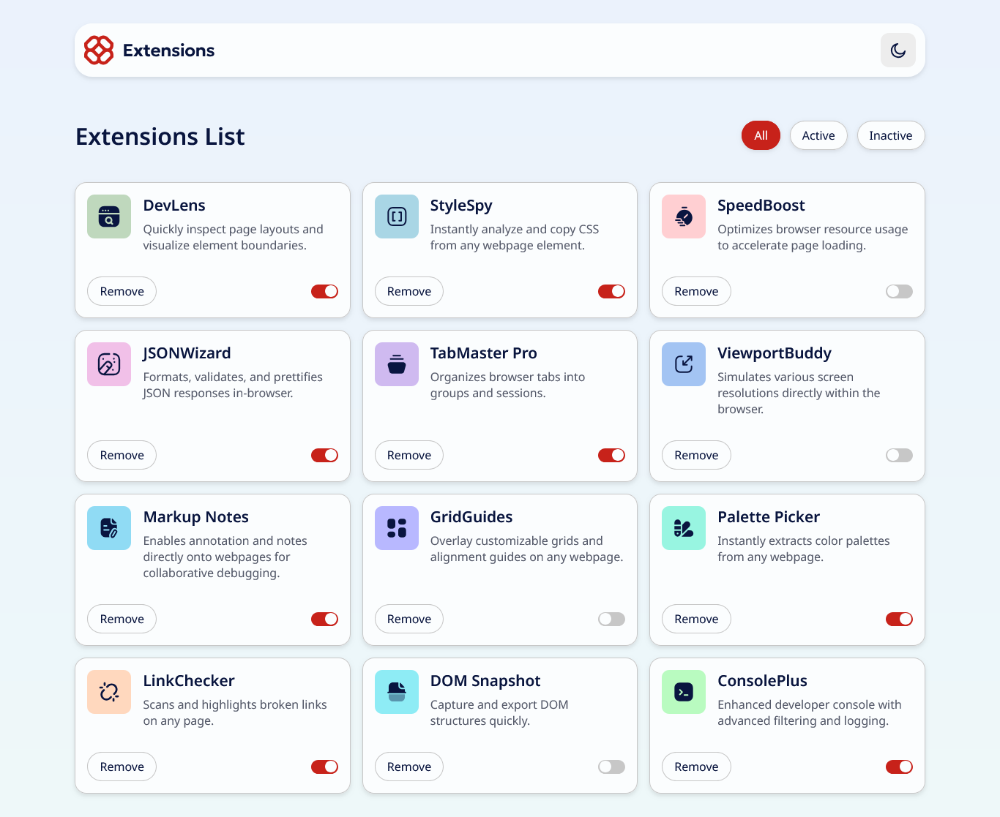

# Frontend Mentor - Browser extensions manager UI solution

This is a solution to the [Browser extensions manager UI challenge on Frontend Mentor](https://www.frontendmentor.io/challenges/browser-extension-manager-ui-yNZnOfsMAp). Frontend Mentor challenges help you improve your coding skills by building realistic projects. 

## Table of contents

- [Overview](#overview)
  - [The challenge](#the-challenge)
  - [Screenshot](#screenshot)
  - [Links](#links)
  - [Built with](#built-with)
  - [Continued development](#continued-development)
  - [Useful resources](#useful-resources)
- [Author](#author)

## Overview

Hi everyone! This is my first project from Frontend Mentor. As mentioned above, it's a browser extensions manager — it's responsive, supports light and dark themes, and includes filter and remove functionalities.
I tried to match the original Frontend Mentor design as closely as possible, but I'm sure I made some mistakes. Feel free to share any feedback on this project!.

### The challenge

Users should be able to:

- Toggle extensions between active and inactive states
- Filter active and inactive extensions
- Remove extensions from the list
- Select their color theme
- View the optimal layout for the interface depending on their device's screen size
- See hover and focus states for all interactive elements on the page

### Screenshot

### Links

- Solution URL: [Add solution URL here](https://your-solution-url.com)
- Live Site URL: [Add live site URL here](https://your-live-site-url.com)

### Built with

- CSS BEM
- Semantic HTML5 markup
- CSS custom properties
- Flexbox
- CSS Grid
- Desktop-first workflow

### Continued development

I want to work on the transitions and animations — maybe add some fade-in effects when the page loads, and smooth transitions when the cards disappear.

### Useful resources

- [Responsively](https://responsively.app/) - This helped me to make the site responsive in various devices.

## Author

- Frontend Mentor - [@yourusername](https://www.frontendmentor.io/profile/Nicron7)
